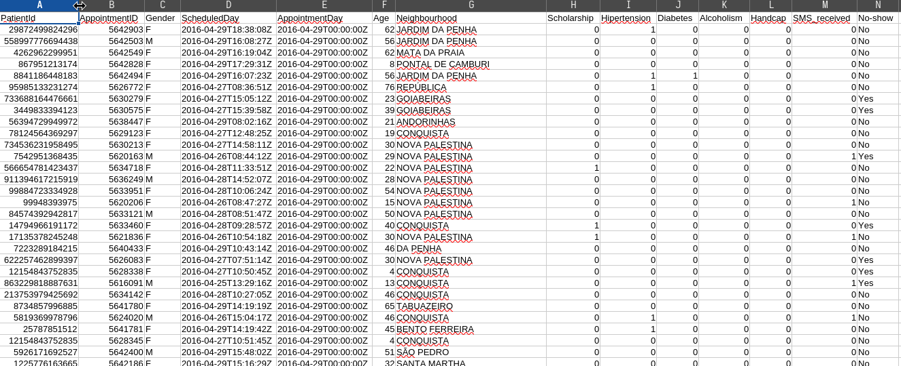

# Strategic Healthcare Analytics: Predictive Modeling of Patient No-Shows

An end-semester Business Intelligence project that analyzes healthcare appointment attendance patterns and identifies the strongest drivers of patient no-shows using Power BI.

## Table of Contents

- [Student Information](#student-information)
- [Executive Summary](#executive-summary)
- [Project Objectives](#project-objectives)
- [Problem Statement](#problem-statement)
- [Dataset Overview](#dataset-overview)
- [Tools and Technologies](#tools-and-technologies)
- [Methodology](#methodology)
- [Dashboard Scope](#dashboard-scope)
- [Key Analytical Findings](#key-analytical-findings)
- [Project Deliverables](#project-deliverables)
- [Dashboard Previews](#dashboard-previews)
- [Key Project Images](#key-project-images)
- [Folder Structure](#folder-structure)
- [How to Review This Project](#how-to-review-this-project)
- [Conclusion](#conclusion)

## Student Information

| Field | Details |
|---|---|
| Student Name | Calvin Gacheru Mwangi |
| Admission Number | 670035 |
| Course Code | DSA 3050A |

## Executive Summary

Patient no-shows reduce healthcare efficiency by creating idle capacity, increasing waiting times, and weakening continuity of care. This project processes 110,527 appointment records and converts raw operational data into an analytical model that supports root-cause analysis and actionable interventions.

The final output is a multi-page Power BI report designed for decision-makers, with KPIs, trend monitoring, and drill-down views to isolate risk factors behind missed appointments.

## Project Objectives

- Quantify appointment attendance and no-show behavior.
- Identify demographic, clinical, and scheduling factors associated with absenteeism.
- Build a reliable star-schema model for scalable analytics.
- Deliver an executive-ready dashboard for operational decision support.

## Problem Statement

Healthcare providers lose productivity when appointments are missed without notice. The goal of this analysis is to determine which variables most strongly predict no-shows, so hospitals and clinics can improve reminder strategy, scheduling policies, and outreach prioritization.

## Dataset Overview

| Attribute | Value |
|---|---|
| Source | Kaggle - Medical Appointment No-Shows |
| Volume | 110,527 records |
| Domain | Healthcare operations |
| Core Fields | Patient identifiers, scheduling and appointment timestamps, age, gender, neighborhood, scholarship, hypertension, diabetes, SMS received |

Data files used in this project:
- [Medical Appointment No-Shows.csv](Data/Medical%20Appointment%20No-Shows.csv)
- [Medical No-Show.csv](Data/Medical%20No-Show.csv)

## Tools and Technologies

- Power BI Desktop for data modeling and dashboard development
- Power Query for data cleaning and transformation (ETL)
- DAX for calculated columns, KPIs, and time-intelligence measures
- GitHub for project versioning and documentation

## Methodology

1. **Data acquisition and profiling:** Imported source files and validated schema consistency.
2. **Data quality improvement:** Addressed invalid ages, corrected header issues, and removed duplicates.
3. **Transformation and feature engineering:** Split timestamp fields into analytic components and generated age-group categories.
4. **Data modeling:** Converted flat source data into a star schema with one central fact table and supporting dimensions.
5. **DAX measure development:** Built analytical KPIs including no-show rate and month-over-month growth measures.
6. **Dashboard design:** Developed a three-page report for executive summary, detailed analysis, and performance monitoring.

## Dashboard Scope

- Executive Summary: KPI cards, attendance overview, and trend lines.
- Detailed Analysis: decomposition and drill-down views for identifying root causes.
- Performance Monitor: neighborhood and cohort comparisons to detect high-risk segments.

## Key Analytical Findings

1. **Wait time is a major predictor of absenteeism:** Appointments scheduled more than 8 days in advance show about 32% no-show rate versus about 5% for same-day bookings.
2. **SMS reminders are not uniformly effective:** Patients receiving reminders still showed elevated no-show behavior, indicating timing and targeting improvements are needed.
3. **No-show volume is concentrated in specific demographics:** Adult female cohorts represent the largest total volume of missed appointments.

## Project Deliverables

- [PowerBI Report.pbix](PowerBI%20Report.pbix)
- [REPORT.pdf](REPORT.pdf)
- [Examination Instructions.pdf](Examination%20Instructions.pdf)
- [Screenshots](Screenshots/)

## Dashboard Previews

Embedded dashboard pages (click any image to open the full project file):

### Executive Summary Dashboard
[](PowerBI%20Report.pbix)

### Detailed Analysis Dashboard
[](PowerBI%20Report.pbix)

### Geographic and Segment Performance Dashboard
[](PowerBI%20Report.pbix)

## Key Project Images

### Dataset Snapshot


### Kaggle Source Reference


## Folder Structure

```text
End Semester Project/
|-- README.md
|-- REPORT.pdf
|-- PowerBI Report.pbix
|-- Examination Instructions.pdf
|-- Data/
|   |-- Medical Appointment No-Shows.csv
|   `-- Medical No-Show.csv
`-- Screenshots/
```

## How to Review This Project

1. Read [REPORT.pdf](REPORT.pdf) for the full written analysis.
2. Open [PowerBI Report.pbix](PowerBI%20Report.pbix) in Power BI Desktop.
3. Review embedded dashboard previews and key visuals in this README.
4. Use assets in [Screenshots](Screenshots/) for additional visual references.

## Conclusion

The analysis confirms that scheduling lead time is the strongest operational predictor of missed appointments. With this BI solution, healthcare teams can target interventions where risk is highest and improve utilization, continuity of care, and planning efficiency.